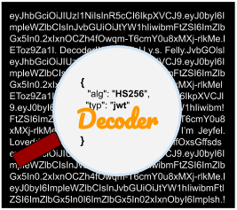

# jwt-decoder

Simple VS Code extension to decode your JSON Web Tokens (JWT)

## Features

The extension currently allows you to decode selected JWT strings in two different ways:

### Selected JWT string within an VS Code untitled tab

- Animation is coming soon!

### Selected JWT string within any VS Code tab

- Animation is coming soon!
