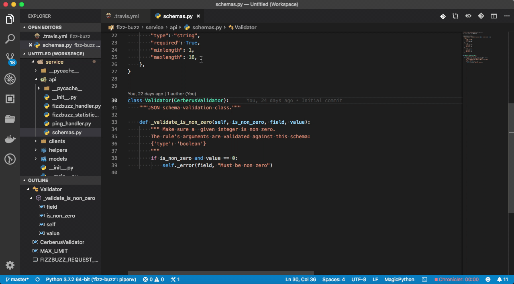
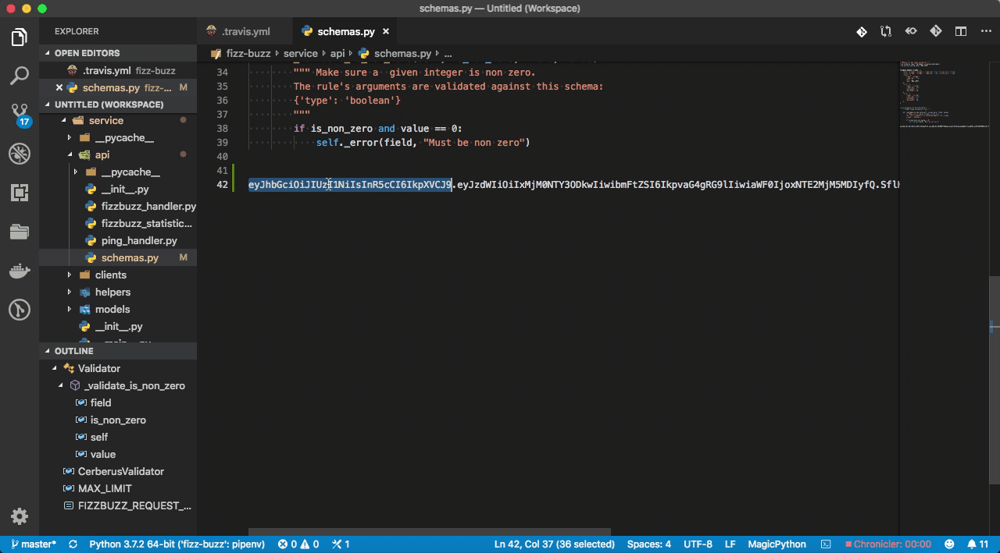
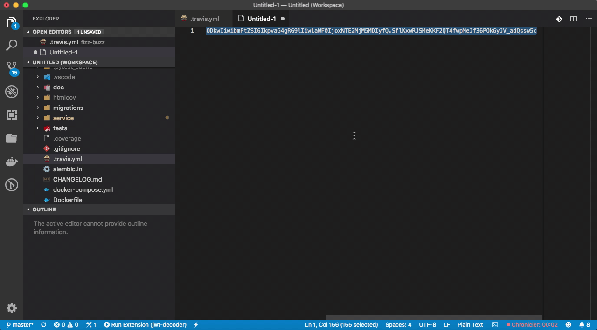

# jwt-decoder

A simple VS Code extension to decode your JSON Web Tokens (JWT)

## Command palette

The extension's name within the Command Palette is `JWT Decoder`.
 
## Features

The extension currently allows you to decode selected JWT strings in three differents ways:

### From Clipboard or Input Box (fallback)

From any document, fire the extension command without text selection. The extension will attempt to decode the clipboard value if it's a valid JWT. Otherwise, you'll be prompted to enter your JWT manually. The decoded token will appear in a message box at the right bottom corner. 

### Hovering over the selected token

From any saved file, `select a JWT string`. Run the extension's command against it. Hover over the JWT string to get a Markdown-formatted of its decoded version.

### Selected JWT string within an VS Code untitled tab

If you call the extension cammand against a `selected JWT string` from an Untitled document, the decoded result will appear below the JWT.

